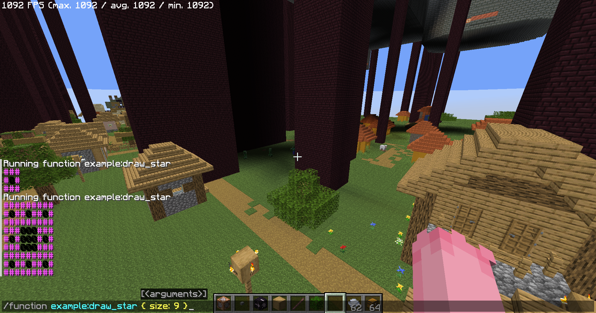
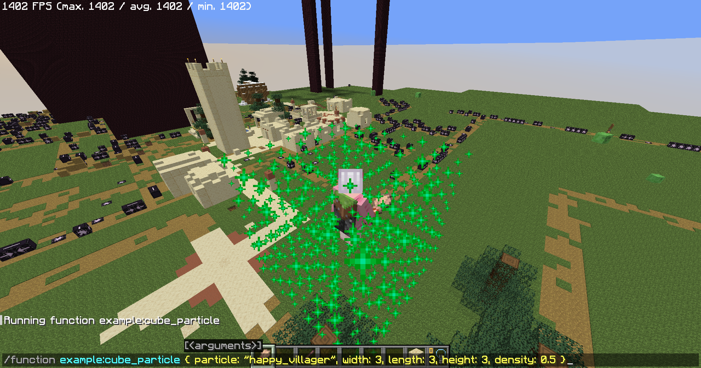

[](https://www.npmjs.com/package/mcslib)
# `mcslib`: Minecraft command script library
`mcslib` is structural programming language coded using javascript, compiles into minecraft datapack.

About language guide, see [guide.md](./guide.md) (in progress)

About language reference, see [reference.md](./reference.md) (in progress)

## Project milestone
 - [x] Expression template literal lexer and parser
 - [ ] Function, string, object, array types
 - [ ] Value types and reference types
 - [ ] Closure and coroutine
 - [x] IR lowering
 - [x] Command template literal parser
 - [x] Execute commands using variable value
 - [ ] Store command result into variable
 - [ ] Load score, nbt value into variable
 - [ ] IR optimization (in progress)
   - [x] Loop optimization
 - [ ] Codegen optimization (in progress)
   - [x] Optimized memory allocation
   - [ ] Dead code elimination (partial)

## Example
### example:draw_star
Source codes in `examples/draw-star.ts`


### example:cube_particle
Source codes in `examples/cube-particle.ts`


Compile example datapack using
```bash
npm start --example=build
```
Run datapack with `intrinsics_datapack`

## License
mcslib and project resources are licensed under MIT license
