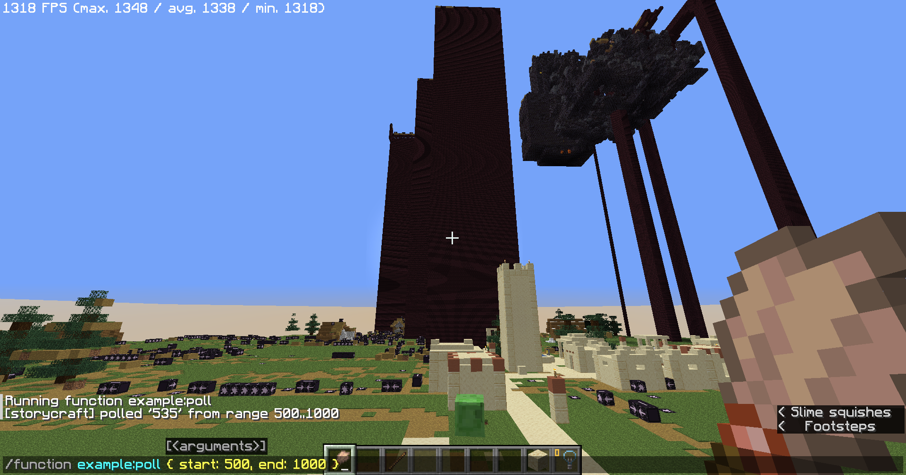
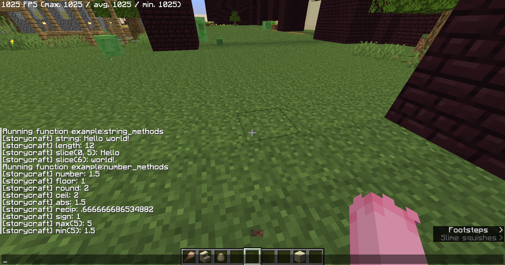

[](https://www.npmjs.com/package/mcslib)
# `mcslib`: Minecraft command script library
`mcslib` is structural programming language coded using javascript, compiles into minecraft datapack.

About language guide, see [guide.md](./guide.md) (in progress)

About language reference, see [reference.md](./reference.md) (in progress)

## Template
See https://github.com/storycraft/mcslib-template

## Project milestone
 - [x] Expression template literal lexer and parser
 - [x] Number type
 - [x] String type
 - [x] Builtin types and methods(static dispatch)
 - [ ] Reference types
 - [ ] Function, object, array types
 - [ ] Closure and coroutine
 - [x] IR lowering
 - [x] Command template literal parser
 - [x] Execute commands using variable value
 - [x] Store command result into variable
 - [ ] IR optimization (in progress)
   - [x] Loop optimization
   - [x] Branch prediction
   - [x] Constant folding
 - [ ] Codegen optimization (in progress)
   - [x] Optimized memory placement
   - [ ] Dead code elimination (partial)

## Example
Compile example datapack using
```bash
npm start --example=build
```
Run datapack with `intrinsics_datapack`

### example:draw_star
Demonstration of string concatenation

Source code in `examples/draw-star.ts`


### example:cube_particle
Demonstration of running particle command using variable value

Source code in `examples/cube-particle.ts`


### example:poll
Demonstration of running command using command output

Source code in `examples/poll.ts`


### example:string_methods, example:number_methods
Demonstration of running builtin methods

Source code in `examples/methods.ts`


## License
mcslib and project resources are licensed under MIT license
